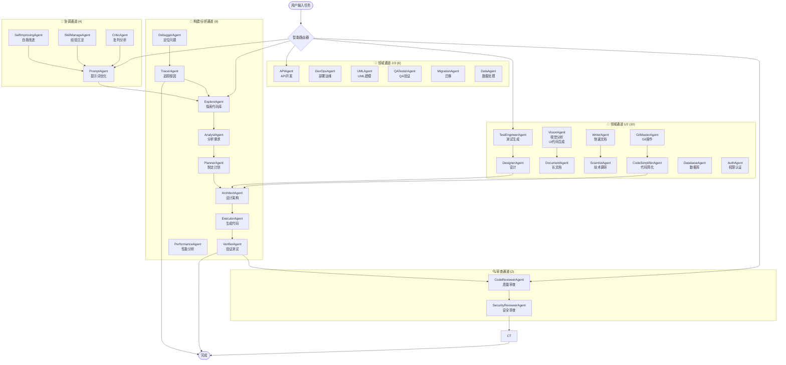

# Oh My Coder (OMC 中文版)

> 🤖 多智能体 AI 编程助手，支持国内大模型

🎯 **GLM-4.7-Flash 开源免费 · 6 个生产就绪模型 + Ollama 本地模型 · 32 个专业 Agent · 多 Agent 协作 · 完全开源**

[](https://github.com/VOBC/oh-my-coder/actions)
[](https://www.python.org/downloads/)
[](LICENSE)
[](https://github.com/VOBC/oh-my-coder/stargazers)
[](https://github.com/VOBC/oh-my-coder/network/members)
[](https://github.com/VOBC/oh-my-coder/commits)
[](https://github.com/VOBC/oh-my-coder/issues)

**灵感来源**: [oh-my-claudecode](https://github.com/Yeachan-Heo/oh-my-claudecode) (28.9k ⭐)


> 🎬 **[Demo 视频 (v0.2.0)](docs/screenshots/demo-v0.2.0.mp4)** - 70秒快速了解核心功能

---

## 📖 目录

- [🎯 为什么选择 Oh My Coder？](#-为什么选择-oh-my-coder)
- [🚀 Claude Code 迁移指南](#-claude-code-迁移指南)
- [💰 零成本起步](#️-零成本起步) **[NEW]**
- [🎯 项目简介](#-项目简介)
- [🚀 快速开始](#-快速开始)
- [👀 快速示例](#-快速示例)
- [🎬 效果演示](docs/screenshots/demo-showcase.md)
- [🌐 Web 界面预览](docs/screenshots/web-preview.md)
- [🏗️ 架构设计](#️-架构设计)
- [🤖 Agent 系统（31 个专业 Agent）](docs/agents/agent-list.md)
- [🧙 Quest Mode（异步自主编程）](#️-quest-mode异步自主编程)
- [🧠 主动学习模块](#-主动学习模块)
- [🧠 分层记忆系统](docs/guide/memory-system.md)
- [🌐 多平台 Gateway](#-多平台-gateway)
- [📂 工作目录上下文感知](#️-工作目录上下文感知)
- [🧠 支持的模型](#-支持的模型)
- [🔄 工作流](#-工作流)
- [📊 任务总结](#-任务总结)
- [🔒 安全特性](#-安全特性)
- [📁 项目结构](#-项目结构)
- [🧪 测试](#-测试)
- [📋 开发进度](#-开发进度)
- [❓ 常见问题](#-常见问题)
- [🤝 贡献](#-贡献)
- [📄 License](#-license)
- [🙏 致谢](#-致谢)

---

## 🎯 为什么选择 Oh My Coder？

> 💰 **零成本起步** — 国产大模型免费额度 + 开箱即用，无需翻墙、无需 Claude 订阅

### ⚠️ Claude 封号？这里是国产替代方案

**2026年4月14日更新**：Claude 官方强制实名认证，中国大陆用户账号被封。如果你正在寻找 Claude Code 的替代品，oh-my-coder 是**最佳国产开源选择**：

| 对比项 | Claude Code | oh-my-coder |
|--------|-------------|-------------|
| **模型** | 仅 Claude（需翻墙） | **6个生产模型 + Ollama**（GLM-4.7-Flash 完全免费） |
| **价格** | 需 Claude Pro ($25/月) | **完全免费开源** |
| **数据隐私** | 上传到海外服务器 | **本地处理，不上传** |
| **中国用户** | 封号风险高 | **完全支持** |
| **Agent数量** | 约10个 | **31个专业Agent** |
| **开源** | 闭源 | **MIT开源协议** |

**迁移指南**：如果你之前用 Claude Code，切换到 oh-my-coder 只需：
```bash
pip install oh-my-coder
omc config set -k GLM_API_KEY -v "your_key"  # 注册获取：https://open.bigmodel.cn/
omc run "你好，介绍一下你自己"
```

---

## 🏆 差异化优势

与 Claude Code、Gemini CLI 等国际工具相比，oh-my-coder 的三大核心优势：

### 1️⃣ 国产模型全家桶（12家 vs 单家）
- **Claude Code**：仅支持 Claude（需翻墙，$25/月）
- **Gemini CLI**：仅支持 Google Gemini
- **oh-my-coder**：✅ **6个生产模型 + Ollama**（GLM-4.7-Flash、DeepSeek-V4、智谱 GLM、Kimi、豆包、百川），GLM-4.7-Flash **完全免费**

### 2️⃣ 中文友好（中文文档 vs 英文为主）
- **Claude Code / Gemini CLI**：英文为主，中文支持有限
- **oh-my-coder**：✅ **全中文交互**，中文文档、中文错误提示、中文 Agent 命名

### 3️⃣ 完全开源可私有部署（vs 闭源）
- **Claude Code**：闭源，无法自托管
- **Gemini CLI**：开源 CLI，但依赖 Google 云服务
- **oh-my-coder**：✅ **MIT 协议完全开源**，支持本地离线运行、私有部署、二次开发

---

### 完整竞品对比（2026年AI编程工具生态）

#### 多Agent编排框架对比

| 工具 | 类型 | Stars | 价格 | 开源 | 国内可用 | 多Agent | 模型支持 |
|------|------|-------|------|------|----------|---------|----------|
| **oh-my-claudecode** | Claude Code插件 | 28,890 ⭐ (截至2026-04-19) | 需Claude Pro ($25/月) | ✅ | ⚠️ 需翻墙 | ✅ 32个Agent | 仅Claude |
| **oh-my-coder** | 多Agent框架 | 较少 | **免费** | **✅ MIT** | **✅** | ✅ 31个Agent | ✅ 12家国产模型 |
| **AutoGen** | 微软多Agent框架 | 大 | 免费 | ✅ | ⚠️ 需翻墙 | ✅ | 多模型 |
| **OpenCode** | 开源CLI | 中 | 免费 | ✅ | ✅ | ✅ | 75+模型 |
| **MyClaude** | 多后端编排 | 小 | 免费 | ✅ | ✅ | ✅ | Claude/Codex/Gemini |

#### 国内AI编程助手对比

| 工具 | 类型 | 价格 | 多Agent | 主要特点 |
|------|------|------|---------|----------|
| **腾讯云CodeBuddy** | IDE插件 | 免费个人版 / ¥78/人/月企业版 | ❌ | MCP协议支持，混元模型 |
| **文心快码(Comate)** | IDE插件 | 免费个人版 / ¥150/人/月企业版 | ✅ | SPEC规范驱动，200+语言 |
| **通义灵码** | IDE插件 | 免费 | ❌ | 阿里系集成 |
| **Cursor** | AI原生IDE | $20/月¹ | ⚠️ API需代理 | AI原生IDE |
| **GitHub Copilot** | 编辑器插件 | $19/月² | ❌ | GitHub生态集成 |
| **Claude Code** | AI编程CLI | 需Claude Pro ($25/月) | ✅ | 原生CLI，Agent能力 |
| **Qoder** | 多Agent编程 | 免费+付费 | ✅ | 多Agent协作 |

#### oh-my-coder 的定位

> **同类开源项目对比**：oh-my-coder 是目前**唯一一个**将多Agent编排框架 + 国产模型 + 中文交互 + 完全免费结合起来的开源项目。
>
> 与原版 oh-my-claudecode（28,890 ⭐ (截至2026-04-19)）相比，我们聚焦在**国产模型支持**和**零成本**两个核心差异点，适合无法使用Claude Pro/翻墙的国内开发者。

> 📌 **价格说明**：
> 1. Cursor: $20/月（以官网 https://cursor.sh 为准）
> 2. GitHub Copilot: $19/月（以官网 https://github.com/features/copilot 为准）
> 3. DeepSeek API 赠送额度（以 DeepSeek 官网活动为准）
> 4. 腾讯云CodeBuddy: ¥78/人/月企业版（以官网 copilot.tencent.com 为准）
> 5. 文心快码Comate: ¥150/人/月企业版（以官网 comate.baidu.com 为准）

### 核心优势对比

| 特性 | Oh My Coder | oh-my-claudecode | 腾讯CodeBuddy | Cursor | Copilot | AutoGen |
|------|:-----------:|:----------------:|:-------------:|:------:|:-------:|:-------:|
| 多Agent协作 | ✅ 31个 | ✅ 32个 | ❌ | ❌ | ❌ | ✅ |
| 开源免费 | ✅ MIT | ✅ | ⚠️ 企业版付费 | ❌ $20/月 | ❌ $19/月 | ✅ |
| 国内直连 | ✅ | ❌ 需翻墙 | ✅ | ❌ 需翻墙 | ❌ 需翻墙 | ✅ |
| 国产模型支持 | ✅ 6个生产 + Ollama | ❌ | ✅ 混元 | ❌ | ❌ | ❌ |
| 中文交互 | ✅ | ❌ | ✅ | ✅ | ✅ | ⚠️ |
| 本地运行 | ✅ | ⚠️ 需Claude Code | ❌ | ❌ | ❌ | ✅ |
| 自托管 | ✅ | ❌ | ❌ | ❌ | ❌ | ✅ |
| **核心差异** | **国产模型+零成本** | **Claude生态** | **大厂背书** | **AI原生IDE** | **GitHub集成** | **企业级框架** |

> 🎯 **定位**：oh-my-claudecode 聚焦 Claude 生态（28,890 ⭐ (截至2026-04-19)，32个Agent，社区成熟）。我们专注**国产模型直连 + 中文优化 + 本地离线运行**，为国内开发者提供零门槛的多Agent编程体验。

---

## 🚀 Claude Code 迁移指南


> 📖 [完整说明请看 Claude Code 迁移完整指南](docs/guide/claude-migration.md)

---

## 📌 项目简介

Oh My Coder 是一个**多智能体协作编程系统**，通过多个专业 Agent 协作完成复杂开发任务。

**核心优势：**
- 🧠 **智能路由** - 根据任务类型自动选择合适模型，通过三层模型路由自动选择性价比最高的模型
- 🔄 **协作模式** - 多个 Agent 分工协作，像真实团队一样工作
- 🇨🇳 **中文优先** - 本土化设计，支持国内主流大模型
- ⚡ **成本优化** - 优先使用低成本/免费模型，支持 DeepSeek 等高性价比选项
- 🧠 **自动 Skills 生成** - 任务完成后自动判断是否值得沉淀为 Skill，4种触发条件：工具调用≥5次、错误修复、用户纠正、非平凡工作流，自动生成符合 SKILL.md 规范的技能文件，学习曲线：越用越聪明
- 🌐 **多平台 Gateway** - 支持 Telegram Bot / Discord Bot 双向消息，统一消息格式，跨平台协作，CLI 一键启动：`omc gateway start --telegram <token>`

---

## 💰 零成本起步

> 无需信用卡，无需充值，直接使用免费模型开始编程

### 三步快速配置

```bash
# 方式1: DeepSeek（推荐）
omc config set -k DEEPSEEK_API_KEY -v "your_key"

# 方式2: 智谱 GLM（需注册获取 API Key，有免费额度）
omc config set -k GLM_API_KEY -v "your_key"  # https://open.bigmodel.cn/

# 方式3: MiMo（长上下文支持）
omc config set -k MIMOX_API_KEY -v "your_key"
```

### 免费模型对比

> 📊 数据来源：各平台官方文档（2026-04-20）

| 模型 | 免费额度 | 上下文 | 推荐理由 |
|------|----------|--------|----------|
| **DeepSeek V4** | 新用户赠送余额 | **128K** | 首选，代码能力强，性价比高 |
| **智谱 GLM-4.7-Flash** | **完全免费** | **200K** | 零成本，中文优化，128K 输出 |
| **小米 MiMo** | 免费一周活动 | 长上下文 | 小米出品，大文件处理 |

💡 **推荐策略**：先用 GLM-4.7-Flash（完全免费），不够再切换 DeepSeek

详细对比: [免费模型推荐](docs/guide/free-models.md)

---

## ⚡ 快速开始

> 📖 [完整安装与配置指南](docs/guide/quickstart-detailed.md)（安装依赖、API Key 配置、模型特定配置、运行方式）

### 三步上手

**第一步：安装**（Python 3.10+，pip）
```bash
pip install -e .
# 或开发模式（可改源码）：pip install -e ".[dev]"
```

**第二步：配置 API Key**（任选其一，免费额度先用）
```bash
# 方式 A：智谱 GLM（推荐，首次注册送大量免费额度）
omc config set -k GLM_API_KEY -v "your_key"
# 注册地址：https://open.bigmodel.cn/

# 方式 B：DeepSeek（新用户赠送余额，128K 上下文）
omc config set -k DEEPSEEK_API_KEY -v "your_key"
# 注册地址：https://platform.deepseek.com/

# 方式 C：通义千问
omc config set -k QWEN_API_KEY -v "your_key"
```

**第三步：启动**
```bash
# Web 界面（浏览器访问 http://localhost:8000）
omc web

# 或 CLI 交互
omc run "你好，介绍一下你自己"
```

> 要求：Python 3.9+（生产环境 3.10+），无需翻墙，无需信用卡

## 👀 快速示例

### CLI 示例

```bash
# 探索当前项目
python -m src.cli explore .

# 执行一个完整构建任务
python -m src.cli run "为用户模块添加 CRUD 接口"

# 代码审查
python -m src.cli run "审查 src/api 目录下的代码" -w review

# 调试问题
python -m src.cli run "修复登录接口偶发的超时问题" -w debug

# 查看所有 Agent
python -m src.cli agents

# === Quest Mode (异步自主编程) ===
# 创建 Quest
python -m src.cli run "实现用户认证模块" --quest

# 查看 Quest 列表
python -m src.cli quest-list

# 查看 Quest 状态
python -m src.cli quest-status <quest-id>

# 订阅桌面通知 + Webhook
python -m src.cli quest-notify --dingtalk https://oapi.dingtalk.com/robot/send?access_token=xxx

# === 工作目录上下文感知 ===
# 扫描项目文件
python -m src.cli context scan

# 获取项目摘要
python -m src.cli context summary

# 查看浏览器上下文（当前打开的标签页）
python -m src.cli context browser

# === 配置管理 ===
# 查看当前配置
python -m src.cli config show

# 设置 API Key（使用 -k 参数指定变量名，-v 指定值）
python -m src.cli config set -k DEEPSEEK_API_KEY -v <your-key>
python -m src.cli config set -k GLM_API_KEY -v <your-key>

# 列出可用模型
python -m src.cli config list-models

# === 代码清理 ===
# 扫描项目中的冗余代码
python -m src.cli clean .

# 自动修复可清理的问题
python -m src.cli clean . --fix

# 激进模式（自动删除空文件）
python -m src.cli clean . --aggressive

# === 成本估算 ===
# 根据任务描述推荐最优模型
python -m src.cli cost "设计新系统架构"

# 指定涉及文件数量以提高准确性
python -m src.cli cost "重构用户模块" --files 10

# 列出所有可用模型及定价
python -m src.cli cost --list

# === 版本迭代记忆 ===
# 列出历史决策记录
python -m src.cli agent decisions

# 检索相关历史决策（解决鬼打墙问题）
python -m src.cli agent decision "用户登录报错 500"

# 记录新的重要决策
python -m src.cli agent record-decision -t "修复 X 问题" -p "问题描述" -s "解决方案"

# 查看决策记忆统计
python -m src.cli agent decision-stats
```

### Web API 示例

```python
import httpx

# 调用异步执行（SSE 实时推送）
resp = httpx.post(
    "http://localhost:8000/api/execute",
    json={"task": "实现用户认证模块", "workflow": "build"},
    timeout=30
)
# resp.iter_lines() 接收 SSE 流式进度

# 同步执行（直接返回）
resp = httpx.post(
    "http://localhost:8000/api/execute-sync",
    json={"task": "审查 src/core 目录", "workflow": "review"}
)
print(resp.json()["result"])
```

### 输入 → 输出示例

| 任务输入 | 工作流 | 输出 |
|---------|--------|------|
| `"为商品模块添加分页查询接口"` | `build` | 自动探索项目结构 → 分析 API 规范 → 设计 REST 接口 → 生成代码 → 运行测试验证 |
| `"审查 src/auth 目录"` | `review` | 调用 CodeReviewerAgent + SecurityReviewerAgent，返回质量报告和安全建议 |
| `"修复注册接口的空指针异常"` | `debug` | 调用 TracerAgent 追踪调用链 → DebuggerAgent 定位根因 → 自动修复 |
| `"为 order.py 生成单元测试"` | `test` | 调用 TestEngineerAgent 分析函数 → 生成 pytest 测试用例 → 执行验证 |

---

## 💻 VS Code 插件

Oh My Coder 提供官方 VS Code 插件，在编辑器内即可使用所有功能。

### 安装方式

#### 方式 1：从 VSIX 安装（推荐）

1. 下载最新 VSIX 文件：`extensions/vscode/oh-my-coder-0.2.0.vsix`
2. 打开 VS Code，按 `Cmd+Shift+P`（macOS）或 `Ctrl+Shift+P`（Windows/Linux）
3. 输入 `Extensions: Install from VSIX...`
4. 选择下载的 `.vsix` 文件

#### 方式 2：从 Marketplace 安装（待发布）

> 🚧 即将上架 VS Code Marketplace，敬请期待

### 功能特性

| 功能 | 说明 |
|------|------|
| **6 个生产模型** | DeepSeek V4 / R1、智谱 GLM-4、Kimi、百川 |
| **Ollama 本地模型** | 支持本地运行，完全离线 |
| **10 个工作流模板** | build / review / debug / test / autopilot / pair / refactor 等 |
| **状态栏增强** | 实时显示当前模型、任务状态 |
| **历史记录** | 记录任务执行历史，支持模型/工作流筛选 |
| **任务视图** | 查看当前任务进度、Agent 执行情况 |
| **Agents 视图** | 浏览 31 个专业 Agent |

### 使用方法

1. 打开 VS Code，左侧活动栏会出现 OMC 图标
2. 点击图标打开侧边栏，显示三个视图：任务、历史、Agents
3. 底部状态栏显示当前模型（如 `🤖 OMC [DeepSeek]`）
4. 按 `Cmd+Shift+P` 输入 `OMC: Run Task` 开始新任务

---

## 🎬 效果演示

支持 CLI 和 Web 两种使用方式，完整开发流程自动化。

> 📖 [完整效果演示（工作流动画 + CLI 执行示例）](docs/screenshots/demo-showcase.md)

---

## 🌐 Web 界面预览

内置 Web 界面，浏览器打开即可使用，支持任务提交、进度追踪、结果查看。

> 📖 [完整 Web 界面预览（截图 + API 端点 + 调用示例）](docs/screenshots/web-preview.md)

---

## 🏗️ 架构设计

### 多 Agent 协作流程



### 三层模型路由

```
┌──────────────┐     ┌──────────────┐     ┌──────────────┐
│   任务类型    │ ──▶ │   模型层级    │ ──▶ │   提供商选择  │
└──────────────┘     └──────────────┘     └──────────────┘
    EXPLORE              LOW (快)           DeepSeek
    ANALYST              MEDIUM (平衡)       DeepSeek
    ARCHITECT            HIGH (高质量)       DeepSeek
    CODE_GEN             MEDIUM              DeepSeek
    REVIEW               LOW                 DeepSeek
```

---
## 🤖 Agent 系统（31 个专业 Agent）

Oh My Coder 内置 **31 个专业 Agent**，覆盖代码生成、审查、测试、安全、文档等完整开发流程。

> 📖 [完整 Agent 清单（含通道分类与职责说明）](docs/agents/agent-list.md)

---

## 🧙 Quest Mode（异步自主编程）


> 📖 [完整说明请看 Quest Mode 文档](docs/features/quest-mode.md)

---

## 🧠 主动学习模块


> 📖 [完整说明请看 主动学习模块文档](docs/features/active-learning.md)

---

| 平台 | 状态 | 环境变量 |
|------|------|----------|
| Telegram | ✅ | `TELEGRAM_BOT_TOKEN` |
| Discord | ✅ | `DISCORD_BOT_TOKEN` |
| WhatsApp | ✅ | `WHATSAPP_*` |
| 飞书 / Lark | ✅ | `FEISHU_*` |
| 企业微信 | ✅ | `WECOM_*` |
| 钉钉 | ✅ | `DINGTALK_*` |
| Slack | ✅ | `SLACK_*` |

📖 详见 [Gateway 文档](docs/guide/gateway.md)

---

## 🔀 模型切换 CLI

一键切换默认模型，无需重启：

```bash
omc model list            # 列出 12 个模型（✅ 7 个生产就绪，⚠️ 5 个 Beta/待完善）
omc model current         # 显示当前模型
omc model switch glm      # 切换到智谱 GLM
```

配置存储在 `~/.config/oh-my-coder/config.json`，环境变量 `OMC_DEFAULT_MODEL` 优先级更高。

---

## 📂 工作目录上下文感知

Oh My Coder 可以感知当前工作目录和浏览器上下文，为 Agent 提供更准确的信息。

### 功能

| 命令 | 说明 |
|------|------|
| `context scan` | 扫描项目文件结构，生成文件树 |
| `context summary` | 生成项目摘要（语言统计、关键文件） |
| `context tree` | 显示项目文件树 |
| `context stats` | 显示项目统计信息 |
| `context browser` | 获取浏览器当前打开的页面 |
| `checkpoint --list` | 列出所有快照 |
| `checkpoint --restore <id>` | 回滚到指定快照（自动备份当前状态） |
| `checkpoint --diff <id>` | 查看快照与当前工作区的差异 |
| `checkpoint --delete <id>` | 删除快照 |
| `mcp --start` | 启动 MCP Server（stdio 模式） |
| `mcp --install` | 生成 Claude Desktop / Cursor MCP 配置 |
| `mcp --list` | 列出所有 MCP tools 和 resources |
| `mcp --status` | 查看 MCP 连接状态 |

### 使用示例

```bash
# 扫描项目
python -m src.cli context scan

# 获取摘要
python -m src.cli context summary

# 查看浏览器
python -m src.cli context browser
```

---
## 💡 支持的模型

共 **7 个**模型，系统自动按性价比选择：✅ 6 个生产就绪，⚠️ 1 个本地模型。

> 📖 [完整模型配置指南（环境变量、默认模型、状态说明）](docs/guide/model-config.md)

### 生产就绪（推荐优先使用）

| 模型 ID | 名称 | 提供商 | 上下文 | 状态 |
|---------|------|--------|--------|------|
| `deepseek-chat` | DeepSeek V4 | DeepSeek | 128K | ✅ production |
| `deepseek-reasoner` | DeepSeek R1 | DeepSeek | 128K | ✅ production |
| `glm-4-flash` | GLM-4-Flash | 智谱 | 200K | ✅ production |
| `glm-4v-flash` | GLM-4V-Flash（视觉） | 智谱 | 4K 图 | ✅ production |
| `moonshot-v1-128k` | Kimi-V3-Pro | Moonshot | 128K | ✅ production |
| `Baichuan4` | Baichuan4-Turbo | 百川 | 128K | ✅ production |

### 本地模型（Ollama）

| 模型 ID | 名称 | 提供商 | 上下文 | 状态 |
|---------|------|--------|--------|------|
| `ollama` | Ollama 本地模型 | 本地 | 取决于模型 | ✅ production |

> 💡 **Ollama 使用说明**：
> - 安装 Ollama：https://ollama.ai
> - 拉取模型：`ollama pull llama3.2`
> - 列出模型：`ollama list`
> - 聊天：`ollama chat llama3.2`

### 环境变量一览

| 变量名 | 必填 | 说明 |
|--------|------|------|
| `DEEPSEEK_API_KEY` | 推荐 | [DeepSeek 平台](https://platform.deepseek.com/)，新用户赠送余额 |
| `GLM_API_KEY` | 推荐 | [智谱平台](https://open.bigmodel.cn/)，GLM-4-Flash 完全免费 |
| `QWEN_API_KEY` | 可选 | [阿里云百炼](https://dashscope.console.aliyun.com/) |
| `KIMI_API_KEY` | 可选 | [Moonshot](https://platform.moonshot.cn/) |
| `DOUBAO_API_KEY` | 可选 | [火山引擎](https://console.volcengine.com/) |
| `BAIDU_API_KEY` / `ERNIE_API_KEY` | 可选 | [文心一言](https://console.bce.baidu.com/) |
| `MINIMAX_API_KEY` | 可选 | [MiniMax](https://api.minimax.chat/) |
| `MIMOX_API_KEY` | 可选 | [小米 MiMo](https://mimo.ai.utrain.cloud/) |
| `OMC_DEFAULT_MODEL` | 可选 | 覆盖默认模型，如 `deepseek-chat` |
| `REQUEST_TIMEOUT` | 可选 | 请求超时（秒），默认 60 |
| `TELEGRAM_BOT_TOKEN` | 可选 | Telegram Bot Token（Gateway 消息推送） |
| `DISCORD_BOT_TOKEN` | 可选 | Discord Bot Token（Gateway 消息推送） |
| `DINGTALK_ACCESS_TOKEN` | 可选 | 钉钉机器人 Access Token（通知） |
| `WECOM_WEBHOOK_URL` | 可选 | 企业微信机器人 Webhook（通知） |

---

## 🔄 工作流

| 工作流 | 命令 | 说明 |
|--------|------|------|
| 🚀 `build` | `-w build` | 完整开发流程：探索 → 分析 → 设计 → 实现 → 验证 |
| 🔍 `review` | `-w review` | 代码审查 + 安全审查 |
| 🐛 `debug` | `-w debug` | 问题定位 → 修复 → 验证 |
| 🧪 `test` | `-w test` | 设计测试 → 实现测试 → 运行验证 |
| 🤖 `autopilot` | `-w autopilot` | 自动路由：根据任务关键词自动选择合适工作流 |
| 👥 `pair` | `-w pair` | 结对编程：Explorer + Critic 交替协作进行代码审查 |
| 🔧 `refactor` | `-w refactor` | 重构模式：分析热点 → 制定计划 → 执行 → 验证 → 测试 |

---

## 📊 任务总结

每个任务完成后自动生成结构化总结，记录执行全过程：

### 核心功能

| 功能 | 说明 |
|------|------|
| 全流程记录 | 每个 Agent 的执行时间、Token 消耗、执行结果 |
| 成本统计 | 自动计算总成本，支持多模型费用对比 |
| 优化建议 | 根据执行情况智能推荐优化策略 |
| 多格式导出 | JSON（机器解析）、TXT（快速查看）、HTML（报告分享） |

### 使用示例

```python
from src.core.summary import generate_summary, print_summary, save_summary

# 任务完成后生成总结
summary = generate_summary(
    task="为电商系统实现订单模块",
    workflow="build",
    completed_steps=[
        {"agent": "ExploreAgent", "status": "completed", "duration": 2.3, "tokens": 1200, "result": "发现 45 个文件"},
        {"agent": "AnalystAgent", "status": "completed", "duration": 5.1, "tokens": 3500, "result": "识别 3 个实体"},
        {"agent": "ArchitectAgent", "status": "completed", "duration": 8.2, "tokens": 5200, "result": "设计 REST API"},
        {"agent": "ExecutorAgent", "status": "completed", "duration": 15.7, "tokens": 12000, "result": "生成 8 个文件"},
        {"agent": "VerifierAgent", "status": "completed", "duration": 10.3, "tokens": 4800, "result": "pytest 18/18 通过"},
    ],
)

# 打印到终端
print_summary(summary)

# 保存为 HTML 报告
save_path = save_summary(summary, format="html")
# 输出: reports/summary_build_电商系统实现订单模块_20260407_113800.html
```

### 总结输出示例

```
✅ 任务: 为电商系统实现订单模块
📋 工作流: build
⏱️  耗时: 41.6s
💰 成本: ¥0.03
🔢 Token: 26,700
🤖 Agent 数: 5
🔧 模型: deepseek-chat, deepseek-chat, deepseek-reasoner

📊 执行步骤：
  1. ✅ Explore       - 2.3s | 1,200 tokens | 发现 45 个文件
  2. ✅ Analyst       - 5.1s | 3,500 tokens | 识别 3 个实体
  3. ✅ Architect     - 8.2s | 5,200 tokens | 设计 REST API
  4. ✅ Executor      - 15.7s | 12,000 tokens | 生成 8 个文件
  5. ✅ Verifier      - 10.3s | 4,800 tokens | pytest 18/18 通过

💡 优化建议：
  ✅ 执行效率良好，无需特殊优化
```

### 高级用法

```python
from src.core.summary import load_summary, print_summary_compact

# 从历史报告加载
summary = load_summary(Path("reports/summary_xxx.json"))

# 紧凑模式（单行，适合日志）
print_summary_compact(summary)
# 输出: ✅ [build] 为电商系统实现订单模块 | 41.6s | ¥0.03 | 5 agents
```

> 📌 总结文件默认保存在 `reports/` 目录，可通过 `output_dir` 参数自定义路径。

---

## 🧬 GEP 协议支持 (WIP)

> 📖 [完整说明请看 GEP 协议文档](docs/features/gep-protocol.md)

---
## 🔒 安全特性

Oh My Coder 高度重视代码安全：

- **本地执行** - 代码本地运行，不上传云端
- **密钥本地存储** - API 密钥仅存储在本地环境变量
- **安全审查** - 生成的代码经过 SecurityReviewerAgent 安全扫描
- **Diff 预览** - 修改文件前可预览变更（GitMasterAgent）
- **沙盒模式** - 支持在隔离环境中运行（需额外配置）

---

## 📁 项目结构

```
oh-my-coder/
├── src/
│   ├── agents/              # 智能体模块（31 个 Agent）
│   │   ├── base.py          # Agent 基类 & 注册机制
│   │   ├── explore.py       # 代码探索
│   │   ├── analyst.py        # 需求分析
│   │   ├── architect.py      # 架构设计
│   │   ├── executor.py       # 代码实现
│   │   ├── evolution.py      # 🆕 自进化 & 版本迭代记忆
│   │   ├── code_cleaner.py   # 🆕 代码清理 Agent
│   │   ├── cost_optimizer.py  # 🆕 成本优化建议
│   │   ├── smart_test.py     # 🆕 智能测试增强
│   │   └── ...
│   ├── core/                # 核心引擎
│   │   ├── router.py        # 三层模型路由器
│   │   ├── orchestrator.py  # 智能编排引擎
│   │   └── summary.py       # 任务总结生成器
│   ├── models/              # 模型适配层（12 个厂商）
│   │   ├── base.py          # 统一接口
│   │   ├── deepseek.py      # DeepSeek 适配器
│   │   ├── mimo.py          # 小米 MiMo
│   │   ├── glm.py           # 智谱 GLM
│   │   ├── kimi.py          # Kimi
│   │   ├── doubao.py        # 字节豆包
│   │   ├── tiangong.py      # 天工AI
│   │   ├── baichuan.py      # 百川智能
│   │   ├── tongyi.py        # 通义千问
│   │   ├── minimax.py       # MiniMax
│   │   ├── spark.py         # 讯飞星火
│   │   ├── wenxin.py        # 文心一言
│   │   └── hunyuan.py       # 腾讯混元
│   ├── web/                 # 🌐 Web 界面
│   │   ├── app.py           # FastAPI 应用 + SSE
│   │   ├── templates/       # HTML 模板
│   │   └── static/          # CSS 样式
│   ├── cli.py               # CLI 入口
│   └── main.py              # API 入口
├── tests/                   # 测试套件
│   ├── test_web.py          # Web 界面测试
│   └── test_integration.py   # 集成测试
├── examples/                # 示例代码
│   ├── web_demo.py          # Web API 使用示例
│   ├── cli_demo.py          # CLI 使用示例
│   └── advanced_demo.py     # 高级示例（多模型/Agent协作/总结）
├── docs/                    # 文档
├── requirements.txt         # 依赖
└── pyproject.toml          # 项目配置
```

---

## 🧪 测试

> 📖 [完整说明请看 测试文档](docs/dev/testing.md)

---
## 📋 开发进度

> 📖 [完整说明请看 开发进度文档](docs/dev/progress.md)

---
## ❓ 常见问题

**Q: API Key 如何获取？**
A: 请访问对应模型的官方网站注册账号后获取：
   - DeepSeek: https://platform.deepseek.com/
   - 小米 MiMo: https://mimo.ai.utrain.cloud/
   - 智谱 GLM: https://open.bigmodel.cn/
   - Kimi: https://platform.moonshot.cn/
   - 豆包: https://console.volcengine.com/
   - 天工AI: https://model-platform.tiangong.cn/
   - 百川智能: https://platform.baichuan-ai.com/
   - 通义千问: https://dashscope.console.aliyun.com/
   - MiniMax: https://api.minimax.chat/
   - 讯飞星火: https://xinghuo.xfyun.cn/
   - 文心一言: https://console.bce.baidu.com/
   - 腾讯混元: https://console.cloud.tencent.com/hunyuan

**Q: 模型调用超时怎么办？**
A: 可通过以下方式解决：
   1. 在 Web 界面调整 timeout 设置
   2. 设置环境变量 `REQUEST_TIMEOUT=60`（秒）
   3. 检查网络连接，确认是否能访问对应 API 地址
   4. 切换到响应更快的模型（如 DeepSeek / 豆包）

**Q: 如何切换不同的模型？**
A: 设置对应模型的环境变量即可：
   ```bash
   export DEEPSEEK_API_KEY=your_key    # 默认使用
   export KIMI_API_KEY=your_key        # 备选模型
   ```
   路由器会根据任务类型和成本自动选择最优模型。

**Q: 生成的代码有安全问题怎么办？**
A: Oh My Coder 内置 SecurityReviewerAgent，会对生成的代码进行安全审查。建议配合 `omc run -w review` 进行额外审查后再合并代码。

**Q: 支持本地部署吗？**
A: 支持。提供三种方式：
   1. 直接安装：`pip install -r requirements.txt && python -m src.cli`
   2. Docker 部署：`docker compose up -d`
   3. 支持对接本地模型 API（如 Ollama）

---

## 🤝 贡献

欢迎提交 Issue 和 PR！详见 [CONTRIBUTING.md](CONTRIBUTING.md)。

### 开发环境搭建

```bash
git clone https://github.com/VOBC/oh-my-coder.git
cd oh-my-coder
python3 -m venv venv && source venv/bin/activate
pip install -e ".[dev]"

# 运行测试
python3 -m pytest tests/ -q

# 代码检查
python3 -m ruff check src/ tests/
python3 -m black src/ tests/

# 提交前完整检查
./scripts/pre-commit.sh
```

### 代码规范

- **ruff** 检查：`python3 -m ruff check src/ tests/`
- **black** 格式化：`python3 -m black src/ tests/`
- **pytest** 测试：`python3 -m pytest tests/ -q`
- 所有 PR 必须通过 CI（ruff + black + pytest）

### 快速贡献

1. Fork 本仓库
2. 创建特性分支 (`git checkout -b feature/amazing-feature`)
3. 提交更改 (`git commit -m 'feat: 添加某个很棒的功能'`)
4. 推送到分支 (`git push origin feature/amazing-feature`)
5. 创建 Pull Request

### 反馈渠道

- 🐛 [提交 Issue](https://github.com/VOBC/oh-my-coder/issues)
- 💬 [讨论区](https://github.com/VOBC/oh-my-coder/discussions)

---

## 📄 License

MIT License - 详见 [LICENSE](LICENSE)

---

## 🙏 致谢

- [oh-my-claudecode](https://github.com/Yeachan-Heo/oh-my-claudecode) 的启发
- [DeepSeek](https://platform.deepseek.com/) 提供优质 API 服务
- 所有贡献者

---

## ❤️ 支持这个项目

如果你觉得这个项目对你有帮助，可以通过以下方式支持我们：

### ⭐ 其他帮助方式

- **给项目点个 Star** — 让更多人看到这个项目
- **提交 Issue** — 反馈问题或建议新功能
- **提交 PR** — 贡献代码，帮助项目变得更好
- **分享给朋友** — 让更多需要的人知道这个工具

---

## 📈 Star History

[](https://star-history.com/#VOBC/oh-my-coder&Date)
