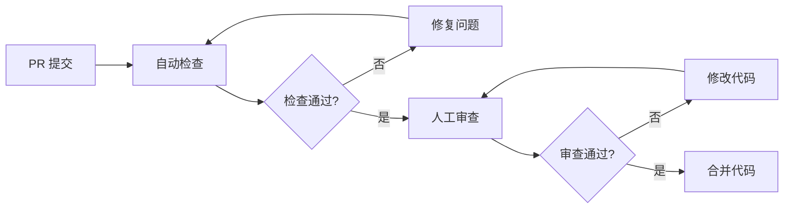

# 代码审查流程

> 本文档定义 Oh My Coder 项目的代码审查标准与流程，确保代码质量、安全性和可维护性。

## 目录

- [审查清单](#审查清单)
  - [安全性](#安全性)
  - [性能](#性能)
  - [可维护性](#可维护性)
- [审查流程](#审查流程)
- [审查标准](#审查标准)
  - [Ruff 检查规则](#ruff-检查规则)
  - [Bandit 安全检查](#bandit-安全检查)
- [审查频率](#审查频率)

---

## 审查清单

### 安全性

| 检查项 | 优先级 | 说明 |
|--------|--------|------|
| 输入验证 | P0 | 所有用户输入必须经过验证和清理 |
| SQL 注入防护 | P0 | 使用参数化查询，禁止字符串拼接 SQL |
| 命令注入防护 | P0 | 避免使用 `os.system()`、`subprocess.shell=True` |
| 敏感信息泄露 | P0 | 禁止在代码中硬编码 API Key、密码、密钥 |
| 路径遍历防护 | P0 | 验证文件路径，禁止 `../` 等跳转 |
| 反序列化安全 | P1 | 谨慎使用 `pickle`、`yaml.load()` |
| 依赖漏洞 | P1 | 定期检查依赖包安全漏洞 |
| 权限控制 | P1 | 敏感操作需要身份验证和授权 |

### 性能

| 检查项 | 优先级 | 说明 |
|--------|--------|------|
| 算法复杂度 | P1 | 避免 O(n²) 及以上复杂度的嵌套循环 |
| 数据库查询 | P1 | 避免 N+1 查询，使用批量操作 |
| 内存使用 | P1 | 大数据集使用生成器而非列表 |
| 异步 IO | P2 | IO 密集型操作使用 `async`/`await` |
| 缓存策略 | P2 | 合理使用缓存减少重复计算 |
| 资源释放 | P2 | 确保文件、连接等资源正确关闭 |

### 可维护性

| 检查项 | 优先级 | 说明 |
|--------|--------|------|
| 代码风格 | P1 | 遵循 PEP 8，使用 Ruff 自动格式化 |
| 类型注解 | P2 | 关键函数添加类型提示 |
| 文档字符串 | P2 | 公共 API 必须有 docstring |
| 命名规范 | P1 | 函数/变量使用 snake_case，类使用 PascalCase |
| 函数长度 | P2 | 单个函数不超过 50 行 |
| 圈复杂度 | P2 | 单个函数圈复杂度不超过 10 |
| 测试覆盖 | P1 | 核心逻辑必须有单元测试 |
| 注释质量 | P2 | 注释解释"为什么"而非"做什么" |

---

## 审查流程



### 1. PR 提交

- 提交前本地运行 `ruff check .` 和 `pytest`
- PR 描述必须包含：
  - 变更目的
  - 主要改动点
  - 测试情况
  - 相关 Issue 链接

### 2. 自动检查

提交 PR 后自动触发：

```bash
# 代码风格检查
ruff check .
ruff format --check .

# 安全扫描
bandit -r src/ -f json -o bandit-report.json

# 单元测试
pytest --cov=src --cov-report=xml
```

### 3. 人工审查

自动检查通过后，由维护者进行人工审查：

- **架构审查**: 设计是否合理，是否符合项目架构
- **逻辑审查**: 业务逻辑是否正确，边界条件是否处理
- **安全审查**: 重点检查安全清单项目
- **性能审查**: 评估性能影响，是否存在明显瓶颈

### 4. 合并标准

- [ ] 所有自动检查通过
- [ ] 至少 1 名维护者批准
- [ ] 无未解决的审查意见
- [ ] 分支与主分支无冲突

---

## 审查标准

### Ruff 检查规则

项目使用 Ruff 进行代码风格检查，配置位于 `ruff.toml`：

```toml
line-length = 88
target-version = "py310"
lint.select = ["E", "F", "W", "I"]
```

**启用的规则集**:

| 规则集 | 说明 |
|--------|------|
| E | pycodestyle 错误 |
| F | Pyflakes 错误 |
| W | pycodestyle 警告 |
| I | isort 导入排序 |

**忽略的特定规则**:

| 规则 | 说明 | 忽略原因 |
|------|------|----------|
| E501 | 行太长 | 88 字符限制已足够 |
| E701 | 一行多语句 | 特定场景需要 |
| B008 | 函数默认参数调用 | FastAPI/Typer 惯用法 |
| B904 | raise from | 覆盖面大，逐个修复成本高 |
| B905 | zip() strict | 行为变更风险 |

**本地检查命令**:

```bash
# 检查代码
ruff check .

# 自动修复问题
ruff check . --fix

# 格式化代码
ruff format .
```

### Bandit 安全检查

Bandit 用于检测 Python 代码中的安全漏洞：

```bash
# 安装
pip install bandit

# 扫描项目
bandit -r src/ -f json -o bandit-report.json

# 详细输出
bandit -r src/ -ll
```

**重点关注的安全问题**:

| 问题 ID | 严重程度 | 说明 |
|---------|----------|------|
| B102 | 高 | 使用 `exec` |
| B105 | 高 | 硬编码密码 |
| B301 | 高 | 使用 `pickle` |
| B307 | 高 | 使用 `eval` |
| B602 | 高 | 使用 `subprocess` shell |
| B605 | 高 | 使用 `start_process` shell |

---

## 审查频率

### 日常审查

- **每次 PR**: 所有代码变更必须通过审查
- **自动检查**: CI 每次提交自动运行

### 定期审查

| 频率 | 范围 | 负责人 |
|------|------|--------|
| **每月** | 新增依赖安全扫描 | 维护者 |
| **每月** | 代码覆盖率检查 | 维护者 |
| **每季度** | 全项目安全审计 | 安全负责人 |
| **每季度** | 架构债务评估 | 架构师 |

### 审查会议

- **周会**: 回顾本周重要 PR，分享审查发现的问题
- **季度复盘**: 分析审查数据，优化审查流程

---

## 相关文档

- [架构设计](./dev/architecture.md)
- [开发规范](./dev/development-report.md)
- [测试指南](./dev/testing.md)

---

**版本**: v1.0.0  
**更新日期**: 2026-04-28
