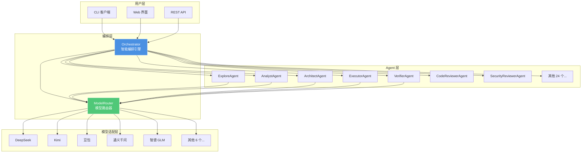
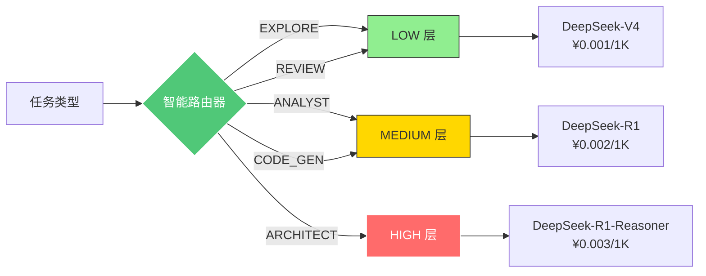
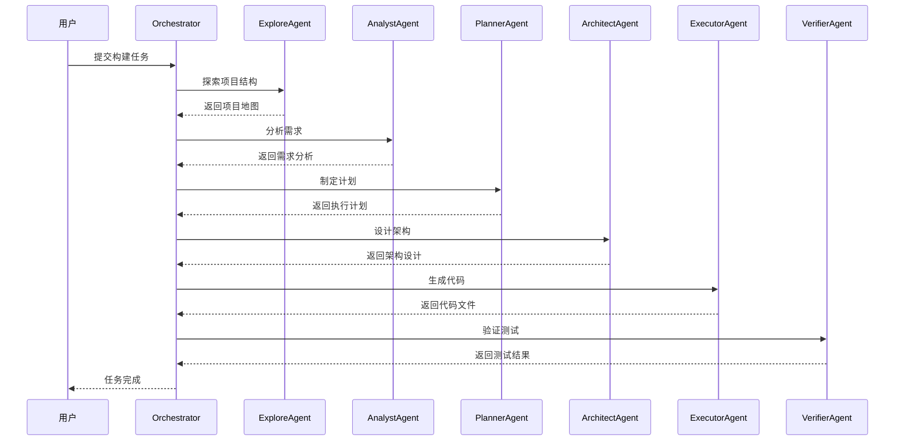
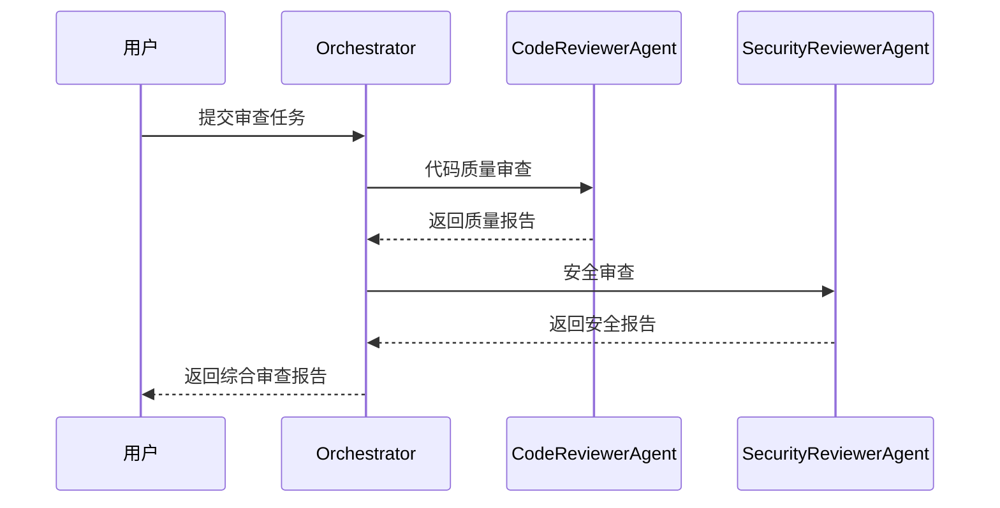
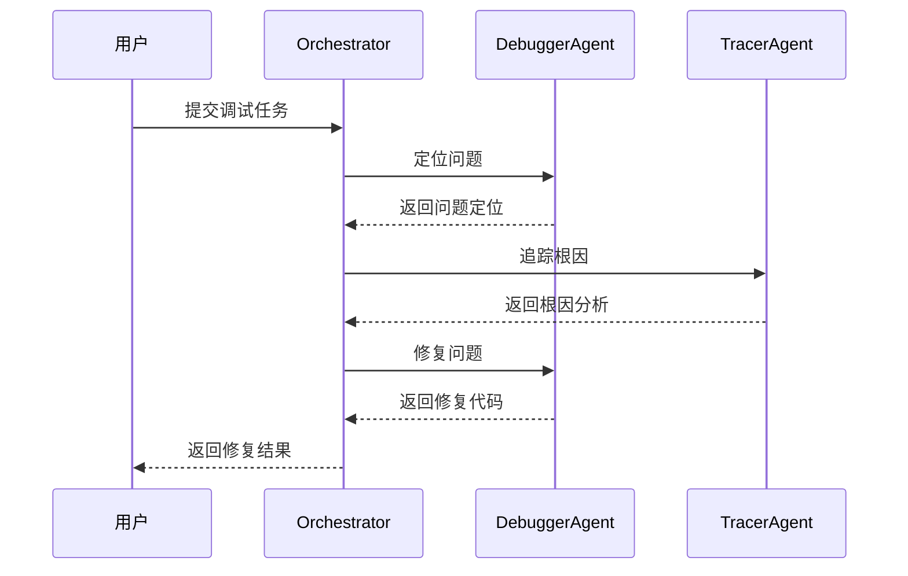
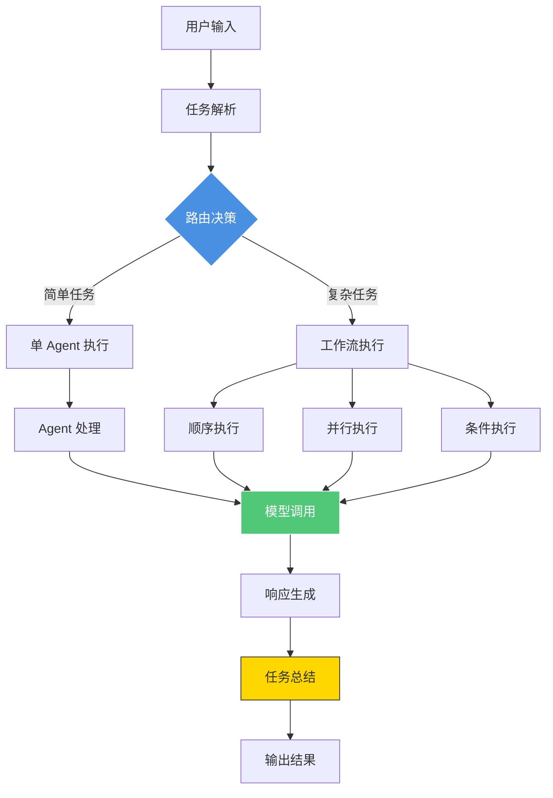
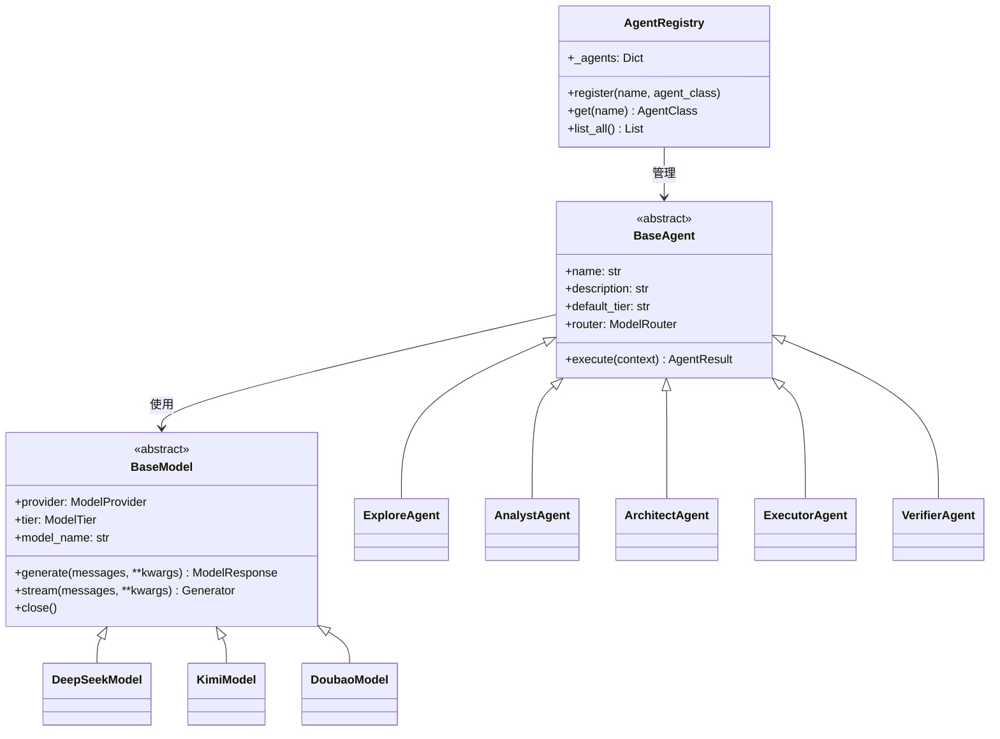
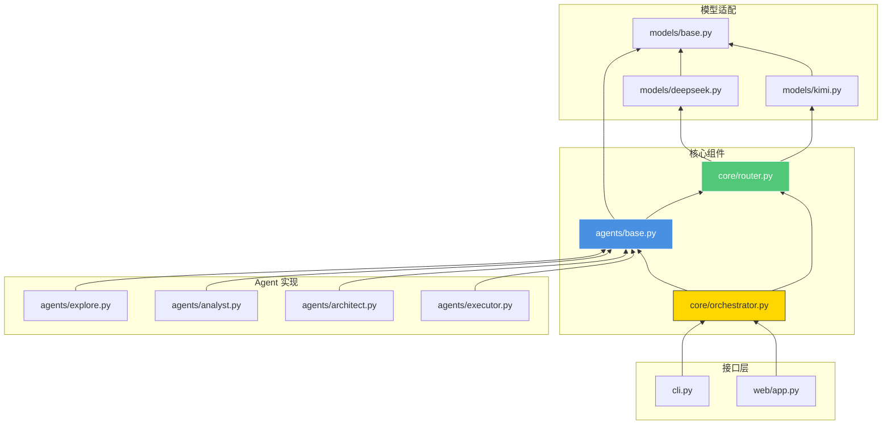
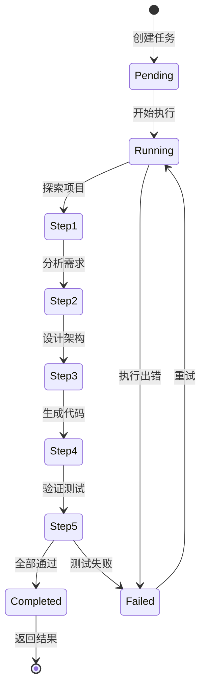
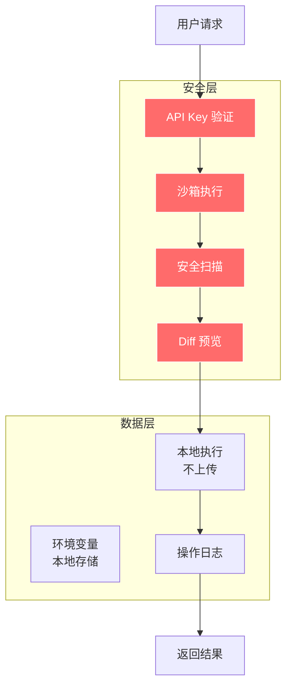

# Oh My Coder 架构设计

## 系统架构总览

## 三层模型路由机制

## 工作流执行流程

### Build 工作流（构建）

### Review 工作流（审查）

### Debug 工作流（调试）

## 数据流图

## Agent 注册机制

## 组件依赖关系

## 状态管理

## 安全架构

## 扩展点

1. **新增 Agent**: 继承 `BaseAgent`，实现 `execute()` 方法
2. **新增模型**: 继承 `BaseModel`，实现 `generate()` 和 `stream()` 方法
3. **新增工作流**: 在 `orchestrator.py` 中添加新的工作流模板
4. **新增接口**: 使用 `Orchestrator` API 创建新的前端

---

**版本**: v1.0.0  
**更新日期**: 2026-04-08
